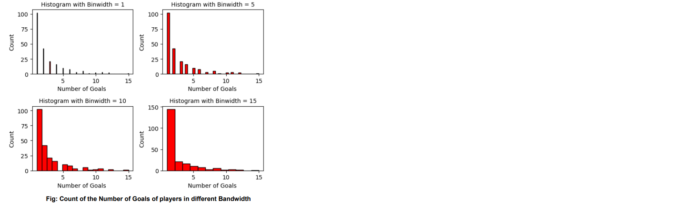
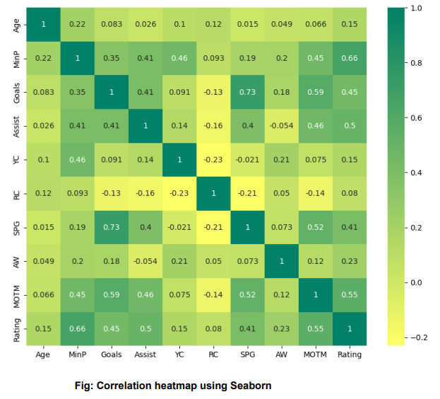

# Bibek portfolio

# Project 1: Analysis of current Laliga players and create a team of Top players for each position 

## Problem statement
We want to analyze teams and players for different positions, starting from Goalkeepers, all
the way to strikers and create a fantasy team that has the best players for each position.
This Fantasy team should beat all the regular teams in the league.
Just by looking at the dataset, we cannot understand the story it wants to tell us. Plus there
are missing values and mixed data types that need to be addressed properly

## Business Statement:
Create a team of Top players for each position

## Dataset:
The dataset provides detailed player statistics for the 2022-2023 La Liga season.
It includes player names, team affiliations, goals, assists, appearances, yellow and red
cards, shots per game, pass accuracy, and ratings as columns. In brief,
Dataset: La Liga Player Status Season 2022-2023

## Category: Sports, Football
Size: 543 rows and 15 columns

### Data Preview

## Data Preparation
- Null Value Identification
- Duplicate values
- Formatting
- Checking for Outliers

## Data Visualization
- Density Plot(Average age of the players)

- Histogram (Count of the Number of Goals of players in different Bandwidth)
  

  
- Bar Chart(Total players in each team)

- Heatmap (Correlation Heatmap)

## Conclusion:
The best player for each position ie Goalkeeper, Defender, Midfielder and Striker ie
Top players for each position looks like this:

Best Player for each position

Note: For further details please check the Jupyter notebook file

